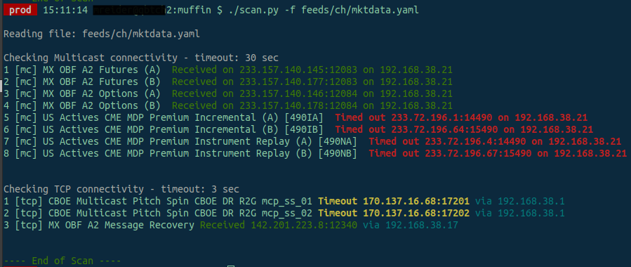

# Muffin


Muffin is a connectivity testing tool designed primarily for Market Data testing but can be used for any multicast or TCP testing

Muffin can test TCP and Multicast connections

This module was created because I need a quick way to test basic market data connectivity health on my physical servers by defining easy to read YAML connectivity files.

Muffin can show you basic connectivity status for your multicast groups and TCP IPs and ports, as well as few other features described below.

Here is a sample scan of my market data feeds:

Sample result of scanning a market data config YAML



---

## Requirements

- Linux OS (Tested on Centos 7 x64 server but should work with any modern Linux OS)
- Python minimum version 3.6 (may work with lower Python3 versions, need to test)

---

## Installation

clone this repository

    cd /opt
    git clone git@github.com:perfecto25/muffin.git


create virtual environment

    cd /opt/muffin
    python3 -m venv venv
    source venv/bin/activate
    pip install -r requirements

    # install via proxy
    pip install --proxy=<proxy hostname>:<proxy port> -r requirements.txt
---

## Configuration

open config.yaml and update your preferences

- feed_files = path to your YAML feed
- mc_timeout = multicast timeout in seconds
- tcp_timeout = tcp timeout in seconds
- hosts = on each host where you run Muffin, update the Solarflare or interface IPs which you use to bind to multicast groups. (this can also be done directly in the feed YAML using "iface"

---

## Usage

1. define a connection file (see sample in **files/sample_feed.yaml**)
1. open config.yaml and update _feed_file_ variable to point to your file (can also pass this as command line flag, see below)
1. make sure config.yaml has IPs of your Solarflare or market data network interfaces (you can also define these in feed files directly, see Configuration section). Muffin uses these IPs to bind to Multicast groups

```
  hosts:
    server1:
      ifaces: ["192.168.38.20", "192.168.38.35"]
      feeds:
        - /path/to/feed/yaml
```

create a symlink to the muffin folder scan entry point

    sudo ln -s /opt/muffin/scan /usr/bin/muffin

run the scan with Onload enabled (kernel bypass)

run

    onload muffin  (OpenOnload is specific to Solarflare ifaces)

Muffin will output connection attempt to each configured Multicast or TCP IP and port

for TCP connections, it will also show you the route gateway over which the IP is being connected to, ie,

```
1 [tcp] CME Futures Feed A Received 120.22.3.3:20010 **via 192.168.10.3**
```

IPs and Ports format can be defined as

    multicast:
      EUREX:
        channel (A) Snapshot: { ip: 224.0.1.2, port: 15001 }

or

    multicast:
      EUREX:
        channel (A) Snapshot: 224.0.1.2:15001

both will be read correctly

if testing multiple ports at once, can define as:

    multicast:
      EUREX:
        channel (A) Snapshot: { ip: 224.0.1.2, port: "15001,15002,15003" }

or a range

    multicast:
      EUREX:
        channel (A) Snapshot: { ip: 224.0.1.2, port: "15001-15005" }

---

## Additional command line flags

    # update config.py 'feed_files' variable with location of your YAML feed files

    ./scan   (this will scan both Mcast and TCP connections based on feed files defined in config.py)

    ./scan -t tcp   (will scan TCP only)

    ./scan -t mcast  (will scan Multicast only)

    ./scan -f /path/to/yaml   (will scan specific YAML feed file, ignoring the config.py setting)

    ./scan -c (provide a different config file path)

    ./scan -d 233.123.100.1:25000  (test multicast connection directly w/out a YAML file)

---

## To convert an XML file to YAML

Muffin can also convert a Market data XML file into a YAML

open convert.py, it currently has conversion functions for CME and ICE market data formats.

at bottom, uncomment the Market type you want to convert, then run script,

    # converting CME XML file to YAML

    ./convert.py /path/to/cme_file.xml

for example, this ICE XML connectivity file can be converted to a feed YAML

```
<group name="ICE Endex Options">
    <top10pl>
        <live ip="233.156.208.116" port="20116" />
        <snapshot ip="233.156.208.117" port="20117" />
    </top10pl>
    <topOfBook>
        <live ip="233.156.208.104" port="20104" />
        <snapshot ip="233.156.208.105" port="20105" />
    </topOfBook>
</group>
```

convered to YAML

```
multicast:
  ICE Endex Options:
    top10pl-live:
      ip: 233.156.208.116
      port: 20116
    top10pl-snapshot:
      ip: 233.156.208.117
      port: 20117
    topOfBook-live:
      ip: 233.156.208.104
      port: 20104
    topOfBook-snapshot:
      ip: 233.156.208.105
      port: 20105
```

